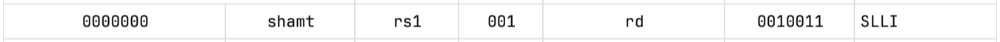

# Immediate Generator

Algumas instruções da ISA RISC-V fazem uso de um valor imediato para serem executadas. Um imediato nada mais é que um valor absoluto codificado dentro dos bits da instrução. Isso significa que esse tipo de instrução usa como dado não só os valores lidos dos registradores como também o valor do imediato. 

Instruções com imediato são fundamentais para a escrita de programas eficientes e possuem vários usos, como veremos a seguir.

## Exemplos de uso de instruções com imediato

### Soma com imediato, `addi`

Tomemos como exemplo a instrução

`addi a0, a1, 10`

Ela soma o valor armazenado no registrador `a1` com o imediato `10` e armazena o resultado no registrador `a0`.

Esse comportamento é particularmente útil para atribuir valores arbitrários para registradores, como na instrução a seguir.

`addi a0, zero, 10`

Nela, o valor do registrador `zero` é sempre 0, de maneira que o registrador `a0` vai receber diretamente o valor `10`.

### Acesso à memória, `load/store`

Outro grupo de instruções que fazem uso de imediatos são as insturções de load/store para acessar a memória. Por exemplo, a instrução

`lw a0, 4(t0)`

significa que o registrador `a0` receberá o valor do endereço de memória indicada pelo registrador `t0` deslocado de `4` posições.

Usar o valor imediato para navegar pela memória é particularmente útil pois ele tira a necessidade de trabalhar a todo momento com manipulação de registradores para gerar o endereço correto. Modificar registradores que armazenam endereços de memória é uma fonte comum de erros em assembly.

Instruções de jump, branches e de shift (entre outras) também fazem uso de imediatos, mas entender o seu uso ficará a cargo do leitor.

## Formas de Indentificar o imediato

Apesar de o imediato ser apenas um número e parecer ser simples identificá-lo dentro da instrução, extrair o seu valor é uma tarefa que exige bastante atenção ao [manual oficial da ISA RISC-V](https://drive.google.com/file/d/1uviu1nH-tScFfgrovvFCrj7Omv8tFtkp/view). Novamente, o principal trecho a ser lido é a lista presente na página 609, Capítulo 35 "RV32/64G Instruction Set Listings".

Primeiro, deve-se notar que os imediatos podem aparecer de várias formas diferentes e com os bits fora de ordem. Veja novamente essa tabela com os diferentes formatos de instrução.


Outro ponto muito importante é que o imediato é um valor de 32 bits. Obviamente, o número completo não cabe dentro da instrução, e apenas parte do imediato está disponível. Para formar o número de 32 bits, o valor extraido da instrução deve ser estendido com sinal ou então ter seus bits deslocados.

Note que instruções relacionadas a saltos e branches não têm o bit 0 do imediato. Isso acontece porque as instruções estão armazenadas na memória sempre em endereços pares e por isso o bit menos significativo é sempre 0. Note também que as instruções tipo U usam apenas bits mais altos para conseguir gerar imediatos maiores.

Além dessa variedade de formas do imediato se apresentar, as instruções de `shift` ainda tem um outro formato.



Nessas instruções, o imediato é um valor de 5 bits denominado `shamt` (shift amount). Ele deve ser extraído diretamente da instrução, sem extensão de sinal.

## Dicas para gerar o imediato

Existem alguns padrões que podem ser explorados para que o desenvolvimento do gerador de imediato seja mais eficiente.

- Alguns opcodes, como os de `branch` e de `load`, são repetidos para várias instruções, e apresentam o mesmo formato de imediato.
- Entender bem os grupos de instruções (tipo-I, tipo-U, etc) é muito importante para escrever um código mais limpo e claro.

## Atividade

O gerador de imediato a ser desenvolvido é um compoente que recebe a instrução e extrai o imediato. Sua interface é muito simples.

```verilog
module Immediate_Generator (
    input wire [31:0] instr_i,  // Entrada: Instrução
    output reg [31:0] imm_o     // Saída: Imediato extraído da instrução
);
```

## Execução da atividade

Siga o modelo de módulo já fornecido e utilize o testbench e scripts de execução para sua verificação. Em seguida, implemente o circuito de acordo com as especificações e, se necessário, crie outros testes para verificá-lo.

Uma vez que estiver satisfeito com o seu código, execute o script de testes com `./run-all.sh`. Ele mostrará na tela `ERRO` em caso de falha ou `OK` em caso de sucesso.

## Entrega

Realize um *commit* no repositório do **GitHub Classroom**. O sistema de correção automática irá validar sua implementação e atribuir uma nota com base nos testes.

> **Dica:**  
Não altere os arquivos de correção! Para entender como os testes funcionam, consulte o script `run.sh` disponível no repositório.